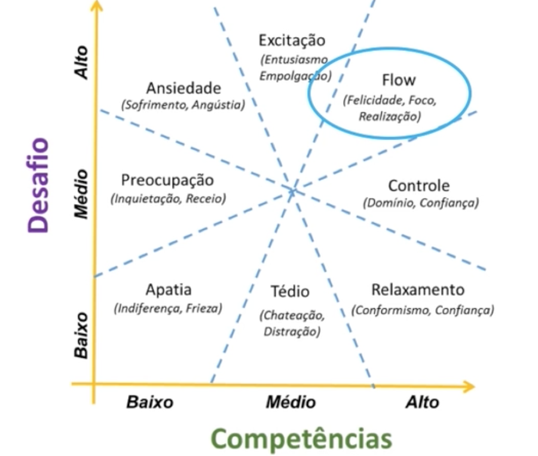

# Oracle Next Education - T7 

Objetivo: Repositório para realizar as tarefas e documentar o aprendizado para o programa da Oracle Next Education - Turma 7

## Desenvolvimento Pessoal 
### Aprendendo a Aprender
**Pontos essenciais para aprender a aprender**
- Estudar um pouco todos os dias
Ao estudar todos os dias o aprendizado se torna uma rotina e estimulamos o pensamento crítico constante

**Prepare um calendário de estudo**
- Ao seguir um calendário de estudos, você não só vai poder se organizar melhor, como poderá olhar para os dias em que estudou e refletir sobre tudo que aprendeu.

**Faça cursos!** 

Em plataformas online ou em cursos síncronos.

**Estude com amigos!** 

Comunidade é uma peça fundamental quando o assunto é estudar.
- Separar tempo 
- Criar um ritmo é fundamental 

Se você é mulher ou LGBTQI+ recomendo fortemente a comunidade **Programaria** e **Reprograma**. 

## Aprendendo a aprender - Técnicas para seu autodesenvolvimento

Aprender é uma construção de experiências. 

**Métodos**
- Criar experiências poderosas
- Autoconhecimento e propósito 
- Estilos e tempos diferentes de aprender
- Disciplina e planejamento 
- Neurociência 
- Hábitos bons e recorrentes 
- Técnicas efetivas de aprendizagem 
- Ferramentas que facilitam a vida

Após 5 anos, 100% das nossas habilidades já precisam ser **atualizadas**. 

"O analfabeto do século 21 não é aquele que não saber ler e escrever, mas aquele que não sabe aprender, desaprender e reaprender. - Alvin Toffler"

Carreira não é mais uma sequência de posições, é uma sequência de **experiências** ao longo do tempo, que fazem um  **impacto** real. 

**Autoconhecimento**
- O que você não sabe? 
- Por que você quer aprender sobre isso? Onde vai usar? **PROPÓSITO**
- Priorize aquilo que é o mais importante. 

**Diferença no resultado**
- Propósito / Missão 
- Curiosidade 
- Paixão 
- Projeto

**Ikigai**

### Técnicas para seu autodesenvolvimento 
1. Talento ou Disciplina? 

Para sair da zona de conforto é necessário que passemos pela fase de Aprendizagem, Estresse e Estusiasmo. 

2. Consistência 

- Disciplina é questão de hábito 
- Criar hábitos: disposição, rotina e recompensa. 

**Explique com suas próprias palavras os principais conceitos que você aprendeu nesta aula.**

Grazielle, parabéns pela dedicação aos estudos! Você abordou pontos importantes da aula, como a transição da zona de conforto para a zona de aprendizagem, a importância de criar novos hábitos e o conceito de flow. Além disso, mencionou a relevância de buscar feedbacks construtivos e o conceito de lifelong learning. Além disso, também vimos na aula a importância de sair da zona de estresse para evitar a ansiedade e manter um estado de flow. A direção é mais importante que a velocidade, e um pouquinho de esforço todo dia pode gerar muitas horas de aprendizado ao longo do tempo. É fundamental não desistir no meio do caminho, pois a criação de bons hábitos leva tempo. Também discutimos sobre os ralos de atenção, que são as distrações que podem desviar nosso foco, e as barreiras físicas e emocionais que podem dificultar nosso progresso. A celebração das pequenas conquistas é essencial para manter a motivação e o entusiasmo ao longo da jornada. Continue estudando e praticando!

## Desvendando o cérebro 
**Mindset fixo e de crescimento**

Recomendação de livro: Mindset, Carol S. Dweck.: Mindset de crescimento e mindset fixo. 

**Mindset fixo**: dificulta nosso processo de nos desenvolvermos 
- A quantidade de inteligência é algo limitado 
- Sou bom em certas coisas 
- Desisto quando fica muito difícil 
- Não me sinto bem com grandes desafios 
- Feedback é uma crítica 
- Prefiro fazer coisas que já sei 

**Mindset de crescimento**: que nos ajuda a aprender coisas novas 
- A quantidade de inteligência é ilimitada 
- Posso ser bom em qualquer coisa 
- Vamos fazer dar certo! 
- Adoro grandes desafios 
- Feedback é uma ajuda para crescer 
- Gosto de aprender a fazer coisas que não sei 

Procure um mentor, professor, amigo que te anime e que você tem o como inspiração. 

**Como o mindset pode mudar ao longo da vida?**
- busque inspiração em mentores 
- autoconfiança
- aproveite todas as oportunidades 
- motivação e foco 
- dedicação 

**Modelo focado e modelo difuso**
- Concentração 
- Repetir padrões 
- Planejado 
- Problemas conhecidos 

Difuso: 
- Visão ampliada 
- Conexões inconscientes
- Aleatório 
- Novas soluções 

Dicas: 
- Estudar mais um tema por vez 
- Ler dois livros ao mesmo tempo
- Ter um emprego e um projeto voluntário 
- Não abrir mão dos momentos de ócio 

**Melhores métodos para aprender de forma eficiente** 
- Auditivo: Podcast, Audio book, ouvir gravaçào de aulas 
- Visual: Infográficos, PowerPoints, Mapa Mentais, Vídeo Aulas, Ted
- Leitura / Escrita: Livros, sites, blogs, artigos, resumos 
- Cinestésico: Eventos, on the job, projetos 

**Memória de longo prazo** 
Aprendizagem é o processo de adquirir informação para memória de longo prazo, juntar diferentes blocos de conhecimento e saber aplicar. 

- Decorar é diferente de entender
- Foco na hora de estudar
- Conhecer o contexto de utilização 
- Assimilar a outros blocos de conhecimento 
- Saber aplicar sozinho 

Aplicar em diferentes situações e revisar por diferentes métodos faz seu cérebro saber acessar por diferentes caminhos. 

Palavra: DISCIPLINA

## Metas ##
1. Por que quero aprender? 
2. Onde vou usar? 
3. Quando quero estar pronto? 

Método SMART
S: específica 
M: mensurável 
A: atingível 
R: relevância 
T: tempo determinado

**METAS CLARAS**: Qual a sua meta de aprendizagem? E quais conhecimentos e atitudes você precisa aprender e/ou aplicar para chegar lá?

**PROCESSO DE APRENDIZADO**: Qual será sua rotina semanal com horários de treino e de pausa para desenvolver estes conhecimentos e atitudes?

**HÁBITOS**: qual o hábito que você pode criar para chegar lá? Quais serão a disposição, a rotina e a recompensa para chegar lá?

**RALOS DE ATENÇÃO**: quais os cuidados deve tomar para eliminar os ralos de atenção para este plano de ação

**EXERCITE ALÉM DO CÉREBRO**: que atividade física você irá manter e/ou incluir na sua rotina para fomentar este desenvolvimento?

## Linkedin: como fazer o seu perfil trabalhar por você  
**O que o Linkedin não é**
- Algo estático 
- Repositório de currículos 
- Lugar para enviar spam

**O que fazer para ter mais destaque?** 
- Compartilhar seu conhecimento de forma generosa
- Ajudar os colegas do grupo respondendo a dúvidas 
- Publicar links úteis e conteúdo relevante 
- Divulgar oportunidades realmente valiosas

**O que fazer para ter mais destaque?**
- Compartilhar seu conhecimento de forma generosa 
- Ajudar os colegas do grupo respondendo a dúvidas 
- Publicar links úteis e conteúdo relevante
- Divulgar oportunidades realmente valiosas 

## Foco: trazendo mais resultados para o dia a dia 
Espera-se com o curso que: 
- Se organize melhor 
- Crie estratégias para manter seu foco 
- Promova seu autoconhecimento 
- Menos distrações 
- Mais força de vontade 

“Fazer muita coisa ao mesmo tempo é meramente a oportunidade de estragar mais de uma coisa ao mesmo tempo.” - Steve Uzzell.

A disciplina sozinha não é suficiente para o sucesso. O que realmente precisamos é direcionar melhor a disciplina que já temos.

Em vez de focar em grandes objetivos, é melhor começar com hábitos e metas menores, que podem ser incorporados gradualmente à nossa rotina.

Cultivar um hábito por vez, com paciência e persistência, é mais eficaz do que tentar mudar tudo de uma vez.

A chave é desenvolver uma mentalidade de crescimento positiva, aproveitando os obstáculos como oportunidades de aprendizado.

**Força de vontade** 

Exercícios para melhorar a força de vontade e autodisciplina:

- Dez minutos de meditação: A meditação é o exercício que apresentará os resultados mais rapidamente.

- Trabalhe sua postura: Melhorar a postura pode ajudar a melhorar a autoconfiança.

- Mantenha controle do que come diariamente: Ter controle sobre a alimentação é um excelente exercício de disciplina.

- Use sua mão oposta: Tente usar sua mão não dominante para realizar tarefas do dia a dia.

- Corrija seu modo de falar: Evite palavras negativas e trabalhe para falar de maneira mais positiva.

- Crie prazos e se obrigue a alcançá-los: Estabelecer metas e trabalhar para alcançá-las pode ajudar a melhorar a autodisciplina.

- Mantenha controle dos seus gastos: Gerenciar o dinheiro de maneira eficaz é um bom exercício para a força de vontade.

- Pressione um handgrip: Este exercício físico pode ajudar a aumentar a força de vontade.

- Persista, recomece ou empenhe-se mais da próxima vez: Não pare no fracasso. Persistir, recomeçar ou empenhar-se mais da próxima vez, essa deve ser sempre a nossa lição nos pequenos fracassos. 
