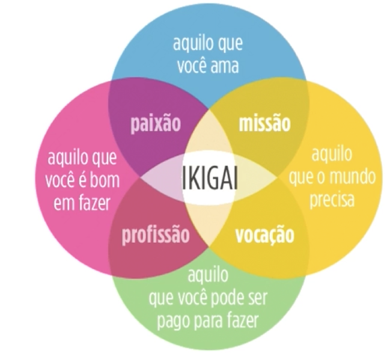

# Oracle Next Education - T7 

Objetivo: Repositório para realizar as tarefas e documentar o aprendizado para o programa da Oracle Next Education - Turma 7

## 01.Desenvolvimento Pessoal 
### Aprendendo a Aprender
**Pontos essenciais para aprender a aprender**
- Estudar um pouco todos os dias
Ao estudar todos os dias o aprendizado se torna uma rotina e estimulamos o pensamento crítico constante

**Prepare um calendário de estudo**
- Ao seguir um calendário de estudos, você não só vai poder se organizar melhor, como poderá olhar para os dias em que estudou e refletir sobre tudo que aprendeu.

**Faça cursos!** 

Em plataformas online ou em cursos síncronos.

**Estude com amigos!** 

Comunidade é uma peça fundamental quando o assunto é estudar.
- Separar tempo 
- Criar um ritmo é fundamental 

Se você é mulher ou LGBTQI+ recomendo fortemente a comunidade **Programaria** e **Reprograma**. 

## 02. Aprendendo a aprender - Técnicas para seu autodesenvolvimento

Aprender é uma construção de experiências. 

**Métodos**
- Criar experiências poderosas
- Autoconhecimento e propósito 
- Estilos e tempos diferentes de aprender
- Disciplina e planejamento 
- Neurociência 
- Hábitos bons e recorrentes 
- Técnicas efetivas de aprendizagem 
- Ferramentas que facilitam a vida

Após 5 anos, 100% das nossas habilidades já precisam ser **atualizadas**. 

"O analfabeto do século 21 não é aquele que não saber ler e escrever, mas aquele que não sabe aprender, desaprender e reaprender. - Alvin Toffler"

Carreira não é mais uma sequência de posições, é uma sequência de **experiências** ao longo do tempo, que fazem um  **impacto** real. 

**Autoconhecimento**
- O que você não sabe? 
- Por que você quer aprender sobre isso? Onde vai usar? **PROPÓSITO**
- Priorize aquilo que é o mais importante. 

**Diferença no resultado**
- Propósito / Missão 
- Curiosidade 
- Paixão 
- Projeto

**Ikigai**
